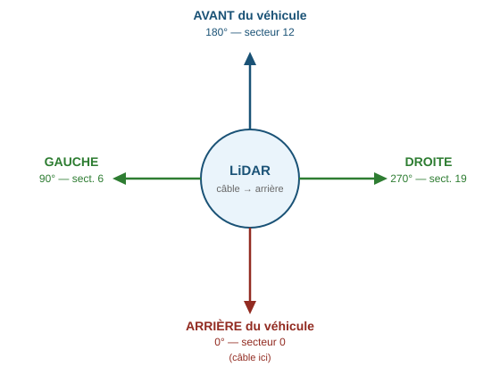

# CoVACIEL_Capteur — Référence API

Ce fichier documente les deux classes de capteurs de distance : `CoVACIEL_radarUS` (radar ultrasonique I2C) et `CoVACIEL_lidar` (LiDAR rotatif RPLidar).

Les deux classes utilisent des **tâches FreeRTOS** pour effectuer les mesures en arrière-plan sans bloquer la boucle principale.

---

## CoVACIEL_radarUS

Pilote un capteur ultrasonique I2C (adresse par défaut `0x70`). La mesure est effectuée en continu dans une tâche de fond.

### Constantes

```cpp
#define UNITE_CM           0x51  // mesure en centimètres (défaut)
#define UNITE_INCH         0x50  // mesure en pouces
#define RADAR_DEFAULT_ADDR 0x70  // adresse I2C par défaut
```

---

### Initialisation

#### `void init(int sda, int scl, int unite = UNITE_CM, int address = RADAR_DEFAULT_ADDR)`

Configure le bus I2C et prépare le capteur. Ne démarre pas encore la tâche de mesure.

| Paramètre | Description |
|---|---|
| `sda` | Broche GPIO SDA |
| `scl` | Broche GPIO SCL |
| `unite` | `UNITE_CM` (cm) ou `UNITE_INCH` (pouces) |
| `address` | Adresse I2C du capteur (défaut : `0x70`) |

```cpp
CoVACIEL_radarUS radar;

void setup() {
    radar.init(8, 9);               // SDA=8, SCL=9, cm, adresse 0x70
    radar.init(8, 9, UNITE_CM, 0x71); // deuxième capteur sur la même paire I2C
}
```

> Pour utiliser plusieurs capteurs sur le même bus I2C, chaque capteur doit avoir une adresse différente (reconfigurable via les registres du composant).

---

### Démarrage / arrêt

#### `void start()`

Lance la tâche FreeRTOS de mesure en arrière-plan. La valeur retournée par `getDistance()` est mise à jour en permanence.

#### `void stop()`

Arrête la tâche de mesure.

```cpp
radar.start(); // à appeler dans setup()
```

---

### Lecture

#### `int getDistance()`

Retourne la dernière distance mesurée dans l'unité choisie à l'initialisation.

```cpp
int d_cm = radar.getDistance(); // en cm si UNITE_CM
```

#### `int getVersion()`

Retourne la version du firmware du capteur. Utile pour vérifier que le composant répond correctement.

```cpp
if (radar.getVersion() == 0) {
    Serial.println("Capteur non détecté !");
}
```

---

### Exemple

```cpp
#include <CoVACIEL.h>

#define SDA_PIN 8
#define SCL_PIN 9

CoVACIEL_radarUS radar;

void setup() {
    radar.init(SDA_PIN, SCL_PIN, UNITE_CM, 0x70);
    radar.start();
}

void loop() {
    int distance_mm = radar.getDistance() * 10; // cm → mm
    Serial.printf("Distance : %d mm\n", distance_mm);
    delay(200);
}
```

---

## CoVACIEL_lidar

Pilote un LiDAR rotatif **RPLidar** (SLAMTEC) via UART. Les données sont collectées dans une tâche FreeRTOS et stockées dans le tableau `distance[23]` indexé par secteur angulaire.

### Constructeur

```cpp
CoVACIEL_lidar(HardwareSerial& lidarSerial)
```

Passe le port série matériel à utiliser pour la communication avec le LiDAR.

```cpp
CoVACIEL_lidar lidar(Serial1);
```

---

### Initialisation

#### `void init(uint32_t baudrate, uint8_t RXpin, uint8_t TXpin, int8_t motorPin = -1)`

Configure le port série et la broche de contrôle moteur du LiDAR.

| Paramètre | Description |
|---|---|
| `baudrate` | Vitesse UART Lidar (460800 pour RPLidar C1) |
| `RXpin` | Broche GPIO RX |
| `TXpin` | Broche GPIO TX |
| `motorPin` | Broche GPIO de contrôle moteur (`-1` si non utilisée) |

```cpp
lidar.init(460800, 16, 17, 5);
```

---

### Démarrage / arrêt

#### `void start()`

Démarre le moteur du LiDAR et lance la tâche FreeRTOS d'acquisition.

#### `void stop()`

Arrête la tâche et le moteur.

#### `void refresh()`

Force une mise à jour du tableau `distance[]`. À appeler si vous n'utilisez pas la tâche de fond.

---

### Montage — orientation du câble

> **Important :** le câble de données du LiDAR doit être orienté vers **l'arrière** du véhicule.
>
> Conséquence : l'**avant** du véhicule correspond au **secteur 11** (≈ 176°) du LiDAR.



---

### Lecture

#### `int distance[23]`

Tableau public contenant les distances en mm, indexé par secteur angulaire (0 à 22, pas = 16°).

Compte tenu de l'orientation câble-arrière (0° LiDAR = arrière véhicule), les secteurs utiles par angle véhicule sont :

| Angle véhicule | Secteur | Plage LiDAR du secteur |
|---|---|---|
| −90° (gauche) | **5** | 80°–95° |
| −45° (avant-gauche) | **8** | 128°–143° |
| 0° (avant) | **11** | 176°–191° |
| +45° (avant-droite) | **14** | 224°–239° |
| +90° (droite) | **16** | 256°–271° |

```cpp
int d_avant        = lidar.distance[11]; //   0° véhicule
int d_avant_gauche = lidar.distance[8];  // −45° véhicule
int d_gauche       = lidar.distance[5];  // −90° véhicule
int d_avant_droite = lidar.distance[14]; // +45° véhicule
int d_droite       = lidar.distance[16]; // +90° véhicule
```

---

### Exemple

```cpp
#include <CoVACIEL.h>

#define LIDAR_BAUDRATE  460800 // RPLIDAR C1
#define LIDAR_RX        16 //fil vert = TX pour ESP32
#define LIDAR_TX        17 //fil jaune = RX pour ESP32
#define LIDAR_MOTOR      5   // -1 si non utilisé

#define CAN_RX          13
#define CAN_TX          12

CoVACIEL_lidar  lidar(Serial1);
CoVACIEL_CAN    canbus;

void setup() {
    lidar.init(LIDAR_BAUDRATE, LIDAR_RX, LIDAR_TX, LIDAR_MOTOR);
    lidar.start();
    canbus.init(CAN_RX, CAN_TX);
}

void loop() {
    // Envoyer les distances du lidar sur le bus CAN
    canbus.setDistAv        (lidar.distance[11], true);
    canbus.setDistAvGauche45(lidar.distance[8],  true);
    canbus.setDistAvDroite45(lidar.distance[14], true);

    canbus.updateRx();
}
```
