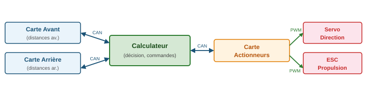

# CoVACIEL — Documentation

CoVACIEL est une bibliothèque Arduino pour le véhicule autonome CoVACIEL, à destination des cartes **ESP32**. Chaque fonction du véhicule (propulsion, direction, capteurs) est assurée par une carte ESP32 dédiée. Les cartes communiquent via un **bus CAN à 250 kbit/s** en utilisant l'API TWAI native de l'ESP-IDF — sans bibliothèque tierce.

---

## Classes

| Classe | Rôle |
|---|---|
| `CoVACIEL_CAN` | Bus CAN (TWAI natif), distances, propulsion, direction |
| `CoVACIEL_direction` | Servo de direction PWM avec calibration persistante |
| `CoVACIEL_propulsion` | ESC de propulsion PWM avec calibration persistante |
| `CoVACIEL_radarUS` | Radar ultrasonique I2C (mesure en tâche FreeRTOS) |
| `CoVACIEL_lidar` | LiDAR rotatif RPLidar (mesure en tâche FreeRTOS) |

---

## Dépendances

- [ArduinoJson](https://arduinojson.org/) ≥ 7.x
- ESP32 Arduino Core ≥ 3.x (API TWAI native, `driver/twai.h`)

---

## Installation

### Via le gestionnaire de bibliothèques Arduino

Rechercher **CoVACIEL** dans le gestionnaire (Outils → Gérer les bibliothèques).

### Installation manuelle

Télécharger le dépôt et copier le dossier `CoVACIEL` dans `Arduino/libraries/`.

---

## Architecture du système



### Pattern requête/réponse — distance arrière

Pour économiser la bande passante, la distance arrière n'est **pas émise en continu** : le calculateur envoie une requête, la carte arrière répond.

```
[Calculateur]  ──── CAN_ID_ARRIERE_REQUEST (0x669) ────►  [Carte Arrière]
[Calculateur]  ◄─── CAN_ID_ARRIERE        (0x667) ──────  [Carte Arrière]
```

Les distances avant sont émises périodiquement par la carte avant et reçues via `updateRx()`.

---

## Utilisation rapide

```cpp
#include <CoVACIEL.h>

CoVACIEL_CAN canbus;

void setup() {
    canbus.init(13, 12);   // RX=13, TX=12, 250 kbit/s
}

void loop() {
    canbus.updateRx();                         // lit les trames entrantes
    int distAvant = canbus.getDistanceAvant(); // mm
    canbus.setAngleDirection(0);               // tout droit
    canbus.setVitesse(30);                     // 30 % avant
}
```

---

## Exemples inclus

| Exemple | Description |
|---|---|
| `01_CAN_Calculateur` | Conduite autonome : distances → angle + vitesse |
| `04_Direction` | Balayage du servo de direction + calibrage interactif |
| `05_Propulsion` | Séquence avant/arrêt/arrière + calibrage ESC |
| `06_RadarUS` | Lecture du radar ultrasonique I2C |
| `07_Lidar` | Affichage des 23 secteurs RPLidar |

---

## Identifiants CAN

| Constante | Valeur | Description |
|---|---|---|
| `CAN_ID_PROPULSION` | `0x660` | Commande / état propulsion |
| `CAN_ID_VITESSE` | `0x662` | Consigne de vitesse |
| `CAN_ID_DIRECTION` | `0x664` | Commande / état direction |
| `CAN_ID_AVANT` | `0x666` | Distances avant (centre, ±45°) |
| `CAN_ID_ARRIERE` | `0x667` | Distances arrière (centre, gauche, droite) |
| `CAN_ID_AVANT_EXT` | `0x668` | Distances avant latérales (±90°) |
| `CAN_ID_ARRIERE_REQUEST` | `0x669` | Requête de mesure arrière |

---

## Secteurs de distance

Le tableau public `distance[NB_SECTEURS]` (23 entrées) stocke toutes les distances en mm :

| Constante | Index | Description |
|---|---|---|
| `DISTANCE_AR` | 0 | Arrière centre |
| `DISTANCE_AR_DROITE` | 3 | Arrière droite |
| `DISTANCE_AV_GAUCHE_90` | 7 | Avant gauche 90° |
| `DISTANCE_AV_GAUCHE_45` | 9 | Avant gauche 45° |
| `DISTANCE_AVANT` | 11 | Avant centre |
| `DISTANCE_AV_DROITE_45` | 13 | Avant droite 45° |
| `DISTANCE_AV_DROITE_90` | 15 | Avant droite 90° |
| `DISTANCE_AR_GAUCHE` | 20 | Arrière gauche |

---

## Référence API détaillée

- [CoVACIEL_CAN](CoVACIEL_CAN.md) — Bus CAN, distances, propulsion, direction
- [CoVACIEL_Actionneur](CoVACIEL_Actionneur.md) — Servo de direction et ESC de propulsion
- [CoVACIEL_Capteur](CoVACIEL_Capteur.md) — Radar ultrasonique I2C et LiDAR

---

## Fichiers sources

| Fichier | Contenu |
|---|---|
| `CoVACIEL.h` | En-tête principal — inclure uniquement celui-ci |
| `CoVACIEL_CAN.h/.cpp` | Gestion du bus CAN |
| `CoVACIEL_Actionneur.h/.cpp` | Servo direction et ESC propulsion |
| `CoVACIEL_Capteur.h/.cpp` | Radar ultrasonique et LiDAR |
| `CoVACIEL_lidar.h` | Driver bas niveau RPLidar |

---

## Licence

MIT — François Riotte
